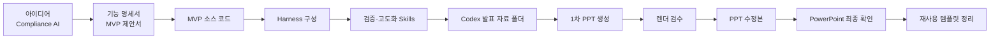
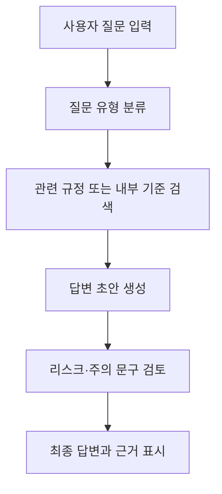

# Harness Engineering으로 완성하는 AI Agent 서비스 고도화 실전

Claude Code로 AI Agent 서비스의 가장 작은 MVP를 만들고, Harness로 검증·개선 루프를 붙인 뒤, Codex로 심사위원이 이해하기 쉬운 발표 자료까지 완성하는 교육용 핸즈온 가이드입니다.

이 문서는 `Compliance AI - 준법자문가 AI Agent 서비스 개발` 예시를 중심으로 진행합니다. 목표는 “AI가 만든 그럴듯한 데모”가 아니라, **기능 명세서 → MVP 제안서 → 소스 코드 → 하네스 검증 → 발표 자료 → 최종 검수**로 이어지는 재사용 가능한 작업 환경을 만드는 것입니다.

> 핵심은 “프롬프트를 한 번 잘 쓰는 것”이 아니라, AI Agent 서비스가 계속 검증되고 고도화되도록 **하네스와 검수 루프를 프로젝트 안에 남기는 것**입니다.

---

## 목차

- [1. 이 가이드로 만들 결과물](#1-이-가이드로-만들-결과물)
- [2. 전체 실습 흐름](#2-전체-실습-흐름)
- [3. Claude Code, Harness, Codex는 어떻게 나눠 쓰나](#3-claude-code-harness-codex는-어떻게-나눠-쓰나)
- [4. 사전 준비](#4-사전-준비)
- [5. 실습용 프로젝트 폴더 구조](#5-실습용-프로젝트-폴더-구조)
- [6. Part 1: 내 서비스를 검증하고 더 똑똑하게 만들기 with Claude Code](#6-part-1-내-서비스를-검증하고-더-똑똑하게-만들기-with-claude-code)
  - [6.1 Harness Engineering 개념 이해](#61-harness-engineering-개념-이해)
  - [6.2 Claude Code CLI 설치](#62-claude-code-cli-설치)
  - [6.3 Harness 플러그인 설치](#63-harness-플러그인-설치)
  - [6.4 기능 명세서와 MVP 제안서 만들기](#64-기능-명세서와-mvp-제안서-만들기)
  - [6.5 가장 간단한 MVP 소스 코드 만들기](#65-가장-간단한-mvp-소스-코드-만들기)
  - [6.6 Harness로 검증·고도화 구조 만들기](#66-harness로-검증고도화-구조-만들기)
  - [6.7 검증 및 고도화 Skills 생성하기](#67-검증-및-고도화-skills-생성하기)
- [7. Part 2: 내 서비스를 심사위원이 이해하는 발표 자료로 만들기 with Codex](#7-part-2-내-서비스를-심사위원이-이해하는-발표-자료로-만들기-with-codex)
  - [7.1 Codex로 PPT 제작 폴더 준비하기](#71-codex로-ppt-제작-폴더-준비하기)
  - [7.2 DESIGN.md 기준 붙여넣기](#72-designmd-기준-붙여넣기)
  - [7.3 Presentations로 1차 PPT 만들기](#73-presentations로-1차-ppt-만들기)
  - [7.4 렌더 이미지와 montage로 1차 검수하기](#74-렌더-이미지와-montage로-1차-검수하기)
  - [7.5 PPT 수정본 만들기](#75-ppt-수정본-만들기)
  - [7.6 Computer Use로 최종 확인하기](#76-computer-use로-최종-확인하기)
  - [7.7 최종 파일과 검수 결과 정리하기](#77-최종-파일과-검수-결과-정리하기)
- [8. 산출물별 확인 기준](#8-산출물별-확인-기준)
- [9. 자주 하는 실수와 우회 방법](#9-자주-하는-실수와-우회-방법)
- [10. FAQ](#10-faq)
- [11. 참고 자료](#11-참고-자료)
- [12. 마지막 체크리스트](#12-마지막-체크리스트)

---

## 1. 이 가이드로 만들 결과물

이 실습에서는 JB금융그룹의 사업 방향성과 연계된 AI Agent 서비스를 직접 기획·개발·검증·발표 자료화하는 흐름을 사용합니다.

예시 주제는 다음과 같습니다.

> `Compliance AI - 준법자문가 AI Agent 서비스 개발`

이 실습이 끝나면 아래와 같은 결과물이 프로젝트 폴더에 남아 있어야 합니다.

| 결과물 | 설명 | 저장 위치 예시 |
|---|---|---|
| 기능 명세서 | 서비스 개요, 시스템 구성도, 핵심 기능, 기능 흐름, 발전 방향을 정리한 문서 | `docs/기능명세서.docx` |
| MVP 제안서 | 문제 정의, 솔루션, 주요 기능, 데이터·기술, 사용자 시나리오, 기대 효과를 담은 발표 초안 | `docs/MVP제안서.pptx` |
| MVP 소스 코드 | 가장 작은 형태로 동작하는 AI Agent 서비스 코드 | `src/`, `app.py`, `package.json` 등 |
| Harness 구성 | 서비스 검증·개선용 에이전트, 스킬, 오케스트레이션 규칙 | `.claude/agents/`, `.claude/skills/` |
| 발표 자료 제작 기준 문서 | Codex가 참고할 발표 목적, 평가 기준, 디자인 기준, 작업 규칙 | `AGENTS.md`, `brand/DESIGN.md`, `context/*.md` |
| 발표 자료 PPT | 편집 가능한 PowerPoint 제안서 | `output/presentation.pptx`, `output/presentation-v2.pptx` |
| 렌더 검수 이미지 | 슬라이드별 PNG와 전체 montage 이미지 | `output/rendered/`, `output/review-montage.png` |
| 최종 검수 요약 | 글자 잘림, 객체 겹침, 민감정보, 출처, 발표 모드 확인 결과 | Codex 응답 또는 `output/review-report.md` |

---

## 2. 전체 실습 흐름

이번 실습은 크게 두 덩어리로 나뉩니다.

첫 번째는 **서비스를 만드는 흐름**입니다. Claude Chat 또는 Claude Cowork로 기능 명세서와 MVP 제안서를 만들고, Claude Code로 가장 작은 소스 코드를 만든 뒤, Harness로 검증·고도화 구조를 붙입니다.

두 번째는 **서비스를 설명하는 흐름**입니다. Codex로 발표 자료 제작 폴더를 준비하고, Presentations로 PPT를 만든 뒤, 렌더 이미지와 Computer Use로 검수합니다.



| 단계 | 사용하는 도구 | 목표 |
|---|---|---|
| 1 | Claude Chat 또는 Claude Cowork | 기능 명세서와 MVP 제안서 초안 생성 |
| 2 | Claude Code IDE | 문서 기반으로 가장 작은 MVP 코드 작성 |
| 3 | Claude Code CLI + Harness | 서비스 검증과 고도화를 위한 하네스 구성 |
| 4 | Codex | 심사위원용 PPT 제작 폴더와 기준 문서 생성 |
| 5 | Presentations | 편집 가능한 PPT 생성 및 렌더 검수 |
| 6 | Computer Use 또는 사람의 PowerPoint 확인 | 실제 발표 파일 최종 점검 |

> 포인트: “서비스 개발”과 “발표 자료 제작”을 한 번에 섞지 않습니다. 먼저 서비스의 근거 자료와 검증 구조를 만들고, 그 다음 발표 자료로 바꿉니다.

---

## 3. Claude Code, Harness, Codex는 어떻게 나눠 쓰나

AI 도구마다 잘하는 일이 다릅니다. 실습에서는 도구를 하나만 쓰는 것이 아니라, 각 도구의 역할을 나눠서 사용합니다.

| 구분 | 주로 하는 일 | 이 실습에서의 역할 |
|---|---|---|
| Claude Chat / Claude Cowork | 아이디어 정리, 문서 초안 작성 | 기능 명세서와 MVP 제안서 생성 |
| Claude Code IDE | 프로젝트 폴더를 보면서 코드 작성 | 기능 명세서와 MVP 제안서를 읽고 MVP 코드 개발 |
| Claude Code CLI | 명령 기반 프로젝트 작업 | Harness 실행, 에이전트·스킬 구성 |
| Harness | 에이전트 팀과 검증 루프 설계 | 서비스의 품질 검증, 리스크 검토, 개선 루프 생성 |
| Codex | 파일과 폴더를 직접 만들고 고치는 작업 | 발표 자료 제작 폴더, 기준 문서, 검수 루프 구성 |
| Presentations | PPT 생성과 렌더 검수 | 편집 가능한 PowerPoint 파일과 검수 이미지 생성 |
| Computer Use | 실제 앱 화면 확인 | PowerPoint에서 열리는지, 글자가 잘리지 않는지 확인 |

정리하면, Claude Code는 **서비스를 만들고 검증하는 작업 환경**에 가깝고, Codex는 **파일 산출물을 만들고 검수하는 작업자**에 가깝습니다.

---

## 4. 사전 준비

실습 전에 아래 항목을 준비합니다.

| 준비물 | 왜 필요한가 | 확인할 점 |
|---|---|---|
| Claude 사용 권한 | Claude Chat, Claude Cowork, Claude Code 사용 | 교육 계정 또는 개인 계정 정책 확인 |
| Claude Code CLI / IDE | 코드 생성, 폴더 작업, Harness 실행 | 설치 후 프로젝트 폴더를 열 수 있는지 확인 |
| Harness 플러그인 | 검증·고도화용 에이전트 팀과 스킬 생성 | 설치 후 `/reload` 실행 |
| Codex 사용 권한 | 발표 자료 제작 폴더와 파일 생성 | 파일 접근 권한 범위 확인 |
| Presentations 플러그인 | PPT 생성과 렌더 검수 | `.pptx`, `rendered/`, montage 생성 가능 여부 확인 |
| PowerPoint 또는 Keynote | 최종 파일 확인 | 실제 발표 환경에서 열리는지 확인 |
| Git 선택 사항 | 변경 이력 관리 | AI가 만든 파일을 비교하고 되돌리기 좋음 |

### 실습 보안 원칙

이 가이드는 교육용 예시입니다. 실제 내부 자료, 고객 정보, 계정 정보, 미공개 사업 전략, 보안 정책, 실명 데이터는 넣지 않습니다.

| 원칙 | 이유 |
|---|---|
| 공개 가능한 예시와 가상 시나리오만 사용 | 교육 자료가 공유 가능해야 함 |
| 민감정보처럼 보이는 문구는 검수 단계에서 제거 | 최종 발표 자료 리스크 감소 |
| 수치와 성과는 과장하지 않음 | 심사위원에게 신뢰감 있는 제안서가 됨 |
| 중요한 텍스트는 이미지 안에 넣지 않음 | PowerPoint에서 나중에 수정하기 위함 |
| AI가 만든 산출물은 반드시 사람이 최종 확인 | 글자 잘림, 사실 오류, 보안 표현을 사람이 잡아야 함 |

---

## 5. 실습용 프로젝트 폴더 구조

먼저 실습용 폴더를 하나 만듭니다. 예시는 아래와 같습니다.

```text
jb-compliance-ai-agent/
├── README.md
├── docs/
│   ├── 기능명세서.docx
│   └── MVP제안서.pptx
├── src/
│   └── ...
├── tests/
│   └── ...
├── .claude/
│   ├── agents/
│   └── skills/
├── AGENTS.md
├── brand/
│   └── DESIGN.md
├── context/
│   ├── evaluation.md
│   └── deck-brief.md
├── assets/
└── output/
    ├── presentation.pptx
    ├── presentation-v2.pptx
    ├── rendered/
    ├── review-montage.png
    └── review-montage-v2.png
```

| 파일/폴더 | 역할 |
|---|---|
| `README.md` | 프로젝트 전체 실습 안내 |
| `docs/` | 기능 명세서와 MVP 제안서 저장 |
| `src/` | AI Agent MVP 소스 코드 |
| `tests/` | 기본 테스트 또는 검증 스크립트 |
| `.claude/agents/` | Harness가 만든 전문 에이전트 정의 |
| `.claude/skills/` | Harness가 만든 검증·고도화 스킬 |
| `AGENTS.md` | Codex가 지켜야 할 프로젝트 작업 규칙 |
| `brand/DESIGN.md` | PPT 디자인 기준 |
| `context/evaluation.md` | 심사 기준과 평가 관점 |
| `context/deck-brief.md` | 발표 자료 목표, 청중, 슬라이드 흐름 |
| `assets/` | 표지 이미지, 다이어그램, 참고 자산 |
| `output/` | 최종 PPT, 렌더 이미지, 검수 결과 |

---

## 6. Part 1: 내 서비스를 검증하고 더 똑똑하게 만들기 with Claude Code

Part 1의 목표는 AI Agent 서비스를 “그럴듯한 아이디어”에서 “검증 가능한 MVP”로 바꾸는 것입니다.

진행 순서는 다음과 같습니다.

1. Harness Engineering 개념 이해
2. Claude Code CLI 설치
3. Harness 플러그인 설치
4. 기능 명세서와 MVP 제안서 생성
5. MVP 소스 코드 개발
6. Harness 구성
7. 검증 및 고도화 Skills 생성

---

### 6.1 Harness Engineering 개념 이해

> 이번 단계에서 할 일: 왜 “프롬프트 한 번”이 아니라 “작업 환경 설계”가 필요한지 이해합니다.

AI에게 “서비스 만들어줘”라고 한 번 요청하면 결과물은 그 한 번으로 끝납니다. 반면 Harness Engineering은 AI Agent가 일하는 환경 자체를 설계합니다. 즉, **어떤 에이전트가 어떤 역할을 맡고, 어떤 순서로 검증하며, 문제가 생기면 어떻게 다시 개선할지**를 미리 정합니다.

| 구분 | 설명 | 실습 예시 |
|---|---|---|
| Prompt | 한 번의 요청 | “기능 명세서 만들어줘” |
| Agent | 특정 역할을 가진 AI 작업자 | 기획 검토자, 보안 검토자, 테스트 작성자 |
| Skill | 반복 가능한 작업 절차 | 명세서 일관성 검토, 리스크 점검, 테스트 시나리오 생성 |
| Harness | Agent와 Skill을 묶은 작업 시스템 | Compliance AI를 반복 검증하고 고도화하는 구조 |

읽어 보면 좋은 자료:

- Harness Engineering 설명: <https://revfactory.github.io/ai-trend-onboarding/ch6.html>
- Harness 플러그인: <https://github.com/revfactory/harness>

> 포인트: 이 실습에서 Harness는 “AI Agent 서비스를 대신 만들어주는 도구”가 아니라, **이미 만든 서비스가 제대로 동작하는지 검증하고 개선하는 팀 구조**입니다.

---

### 6.2 Claude Code CLI 설치

> 이번 단계에서 할 일: 프로젝트 폴더에서 Claude Code CLI를 실행할 수 있게 만듭니다.

Claude Code CLI가 아직 없다면 먼저 설치합니다. 설치 방법은 교육 환경, 운영체제, 회사 보안 정책에 따라 달라질 수 있으므로 교육장에서 안내받은 방식 또는 공식 안내를 따릅니다.

설치가 끝나면 실습 폴더에서 Claude Code CLI를 실행할 수 있어야 합니다. 아래 항목을 확인합니다.

| 확인 항목 | 완료 기준 |
|---|---|
| CLI 실행 | 터미널에서 Claude Code 명령을 실행할 수 있음 |
| 프로젝트 폴더 접근 | 실습 폴더를 열고 파일을 읽을 수 있음 |
| 파일 생성 권한 | `docs/`, `src/`, `.claude/` 같은 폴더를 만들 수 있음 |
| 회사 보안 정책 | 내부 파일이나 개인 파일을 임의로 열지 않도록 범위 제한 |

> 포인트: CLI 설치 자체보다 중요한 것은 “어느 폴더에서 어떤 파일까지 AI가 접근해도 되는지”를 먼저 정하는 것입니다.

---

### 6.3 Harness 플러그인 설치

> 이번 단계에서 할 일: Claude Code에 Harness 플러그인을 설치하고 세션에 반영합니다.

Harness 저장소: <https://github.com/revfactory/harness>

Claude Code 안에서 아래 명령을 차례대로 실행합니다.

```text
/plugin marketplace add revfactory/harness
/plugin install harness@harness-marketplace
/reload
```

설치가 끝나면 프로젝트 폴더에서 Harness를 사용할 수 있는지 확인합니다.

| 확인 항목 | 완료 기준 |
|---|---|
| 플러그인 설치 | marketplace 추가와 harness 설치가 완료됨 |
| `/reload` 실행 | 새로 설치한 플러그인이 현재 Claude Code 세션에 반영됨 |
| Harness 호출 가능 | `/harness` 또는 “하네스 구성해줘” 요청을 사용할 수 있음 |

> 포인트: 플러그인을 설치한 뒤에는 바로 작업하지 말고 `/reload`를 먼저 실행합니다. 새 기능이 현재 세션에 반영되어야 사용할 수 있습니다.

---

### 6.4 기능 명세서와 MVP 제안서 만들기

> 이번 단계에서 할 일: 코드의 밑바탕이 될 기획 문서 2종을 만듭니다.

Claude Chat 또는 Claude Cowork에서 서비스 기획 산출물을 만듭니다. 여기서는 `Compliance AI - 준법자문가 AI Agent 서비스 개발`을 예시로 사용합니다. 아래 프롬프트를 그대로 복사해 사용합니다.

```text
JB금융그룹의 사업 방향성과 연계된 AI Agent 서비스를 기획·개발하는 것이 목표야.

'Compliance AI - 준법자문가 AI Agent 서비스 개발'을 주제로 기능 명세서, MVP 제안서 예시 파일을 생성해줘.

기능 명세서에는 서비스 개요, 시스템 구성도, 핵심 기능 명세, 중요 기능 흐름도, 향후 발전 방향 내용을 포함해서 1~2page의 docx 파일을 생성해줘.

MVP 제안서에는 문제 정의, 제안 솔루션 개요, 주요 기능 정의, 데이터 및 기술 활용, 사용자 시나리오/유즈케이스, 기대 효과 및 향후 확장성 내용을 포함해서 5~7page의 pptx 파일을 생성해줘.
```

생성된 파일은 프로젝트 폴더의 `docs/`에 저장합니다.

```text
jb-compliance-ai-agent/
└── docs/
    ├── 기능명세서.docx
    └── MVP제안서.pptx
```

#### 생성 후 확인할 것

| 확인 항목 | 봐야 하는 이유 |
|---|---|
| 서비스 대상 사용자가 명확한가 | 심사위원이 “누가 쓰는 서비스인지” 바로 이해해야 함 |
| 문제 정의가 금융 업무와 연결되는가 | 단순 챗봇이 아니라 금융 업무 개선 과제여야 함 |
| AI Agent 흐름이 들어 있는가 | 검색, 판단, 생성, 검증, 후속 액션 구조가 보여야 함 |
| MVP 범위가 너무 크지 않은가 | 이후 코드로 만들 수 있는 수준이어야 함 |
| 보안·개인정보·내부통제 고려가 있는가 | 금융 서비스 제안서의 필수 검토 항목 |

> 포인트: 이 단계의 목적은 완벽한 문서가 아닙니다. Claude Code가 읽고 코드를 만들 수 있는 “충분히 구체적인 기준 자료”를 만드는 것입니다.

---

### 6.5 가장 간단한 MVP 소스 코드 만들기

> 이번 단계에서 할 일: 기획 문서를 바탕으로 핵심 흐름만 담은 최소 코드를 만듭니다.

기능 명세서와 MVP 제안서를 프로젝트 폴더에 넣었다면, Claude Code IDE에서 폴더를 열고 가장 작은 형태의 소스 코드를 만듭니다. 아래 프롬프트를 Claude Code IDE에 입력합니다.

```text
기능 명세서와 MVP 제안서를 읽고 가장 간단한 형태의 소스 코드를 개발해줘.
```

이 요청에서 중요한 것은 “완성도 높은 상용 서비스”가 아니라 “핵심 흐름이 보이는 MVP”입니다. 예를 들어 Compliance AI라면 최소한 아래 흐름이 보이면 좋습니다.



#### MVP 코드에서 확인할 것

| 확인 항목 | 완료 기준 |
|---|---|
| 실행 방법 | README 또는 주석만 보고 실행할 수 있음 |
| 핵심 기능 | 질문 입력 → 판단 → 답변 생성 흐름이 있음 |
| 데이터 예시 | 샘플 규정, FAQ, 정책 문서 등 교육용 데이터가 있음 |
| 검증 가능성 | 간단한 테스트 또는 예시 입력이 있음 |
| 리스크 안내 | 답변이 법률 자문 확정이 아니라 검토 보조임을 표시 |

#### 코드 생성 후 이어서 요청하면 좋은 프롬프트

```text
방금 만든 MVP 코드가 기능 명세서와 MVP 제안서의 핵심 흐름을 얼마나 반영했는지 점검해줘.

출력은 다음 형식으로 정리해줘.
- 반영된 요구사항
- 빠진 요구사항
- 지금 MVP에서 의도적으로 제외한 범위
- 다음 개발에서 우선 보완할 항목 3개
```

> 포인트: MVP는 작아야 합니다. 작아야 테스트할 수 있고, 테스트할 수 있어야 Harness로 고도화할 수 있습니다.

---

### 6.6 Harness로 검증·고도화 구조 만들기

> 이번 단계에서 할 일: 문서와 코드를 반복 점검하는 에이전트 팀을 구성합니다.

Claude Code CLI에서 Harness를 실행합니다. 먼저 프로젝트 폴더 안에 아래 자료가 있는지 확인합니다.

```text
jb-compliance-ai-agent/
├── docs/
│   ├── 기능명세서.docx
│   └── MVP제안서.pptx
└── src/
    └── ...
```

Claude Code CLI에서 `/harness`를 실행한 뒤, 아래 프롬프트를 입력합니다.

```text
프로젝트 안의 기능 명세서, MVP 제안서, 소스 코드를 읽고 AI Agent 서비스를 검증하고 고도화하는 하네스를 구성해줘.
```

Harness가 잘 구성되면 일반적으로 아래와 같은 파일이 만들어집니다.

```text
.claude/
├── agents/
│   ├── product-reviewer.md
│   ├── compliance-risk-reviewer.md
│   ├── mvp-tester.md
│   └── improvement-planner.md
└── skills/
    ├── spec-consistency-check/
    │   └── SKILL.md
    ├── compliance-risk-review/
    │   └── SKILL.md
    ├── mvp-scenario-test/
    │   └── SKILL.md
    └── improvement-backlog/
        └── SKILL.md
```

실제 파일명은 Harness가 프로젝트를 분석한 결과에 따라 달라질 수 있습니다.

#### Harness 구성 후 확인할 것

| 확인 항목 | 봐야 하는 이유 |
|---|---|
| 에이전트 역할이 분리되어 있는가 | 기획, 기술, 준법, 테스트 관점이 섞이지 않아야 함 |
| 검증 루프가 있는가 | 생성만 하고 끝나지 않고 점검·개선으로 이어져야 함 |
| 기능 명세서와 코드가 연결되는가 | 문서와 구현이 따로 놀지 않아야 함 |
| 금융 리스크 검토가 포함되는가 | 개인정보, 규제, 내부통제, 환각 위험을 봐야 함 |
| 출력물이 사람이 읽기 쉬운가 | 수강생이 결과를 이해하고 수정할 수 있어야 함 |

> 포인트: 좋은 Harness는 “더 많은 에이전트”가 아니라, **필요한 검증 관점을 빠짐없이 가진 작은 팀**입니다.

---

### 6.7 검증·고도화 Skills 만들기

> 이번 단계에서 할 일: 이 프로젝트에서 반복해 쓸 검증·고도화 절차(Skill)를 정리합니다.

원본 실습 흐름에서는 이 단계를 간단히 “검증 및 고도화 skills 생성!”이라고 표현합니다. 실제 교육에서는 아래처럼 구체적으로 요청하면 수강생이 결과물을 이해하기 쉽습니다.

```text
현재 프로젝트를 기준으로 검증 및 고도화에 필요한 skills를 정리해줘.

목표:
Compliance AI Agent 서비스를 기능 명세서, MVP 제안서, 소스 코드 관점에서 반복 검증하고 개선할 수 있게 만들고 싶어.

성공 기준:
- 기능 명세서와 MVP 제안서의 요구사항 일관성 검증 skill 생성
- 소스 코드가 핵심 유즈케이스를 구현했는지 확인하는 skill 생성
- 준법, 개인정보, 내부통제, 환각 리스크를 점검하는 skill 생성
- 심사위원 평가 기준에 맞춰 보완점을 뽑는 skill 생성
- 각 skill에는 입력 자료, 실행 절차, 출력 형식, 주의사항이 포함되어야 함

출력:
- 생성 또는 수정한 skill 목록
- 각 skill의 역할 한 줄 설명
- 이 프로젝트에서 바로 실행해볼 검증 순서
- 다음 개발 백로그 후보 5개
```

#### 권장 Skills 예시

| Skill | 역할 |
|---|---|
| `spec-consistency-check` | 기능 명세서, MVP 제안서, 코드가 같은 서비스를 말하는지 확인 |
| `mvp-scenario-test` | 대표 사용자 질문으로 MVP가 끝까지 동작하는지 확인 |
| `compliance-risk-review` | 준법, 개인정보, 내부통제, 환각 리스크 검토 |
| `agent-flow-review` | AI Agent의 판단·행동·검증 흐름이 논리적인지 확인 |
| `improvement-backlog` | 본선 또는 다음 개발에서 보완할 항목을 우선순위로 정리 |
| `judge-readiness-review` | 심사위원 평가 기준에 맞춰 부족한 근거와 표현을 찾음 |

#### Skills를 실행한 뒤 확인할 것

| 확인 항목 | 완료 기준 |
|---|---|
| 검증 결과가 구체적인가 | “좋음/나쁨”이 아니라 파일명, 기능명, 문제 위치가 나옴 |
| 개선 제안이 실행 가능한가 | 다음 개발 작업으로 바로 옮길 수 있음 |
| 리스크가 분리되어 있는가 | 기술 문제와 금융 리스크가 구분되어 있음 |
| 반복 실행이 가능한가 | 다음 프로젝트에서도 skill을 재사용할 수 있음 |

> 포인트: Skills는 “AI에게 다시 설명하지 않기 위한 업무 매뉴얼”입니다. 한 번 잘 만들어두면 다음 AI Agent 서비스에도 재사용할 수 있습니다.

---

## 7. Part 2: 내 서비스를 심사위원이 이해하는 발표 자료로 만들기 with Codex

Part 2의 목표는 Part 1에서 만든 서비스와 검증 결과를 바탕으로, 심사위원이 빠르게 이해할 수 있는 발표 자료를 만드는 것입니다.

이 단계에서는 PPT를 바로 만들지 않습니다. 먼저 Codex가 참고할 기준 문서를 만들고, 그다음 PPT를 생성하고, 렌더 이미지로 검수한 뒤, 실제 PowerPoint 화면에서 최종 확인합니다.

진행 순서는 다음과 같습니다.

1. Codex로 발표 자료 제작 폴더 준비
2. `DESIGN.md` 기준 붙여넣기
3. Presentations로 1차 PPT 생성
4. PPT 렌더 검수
5. PPT 수정본 생성
6. Computer Use로 최종 확인
7. 최종 파일과 검수 결과 정리

---

### 7.1 Codex로 PPT 제작 폴더 준비하기

> 이번 단계에서 할 일: PPT를 만들기 전에, Codex가 참고할 기준 문서와 작업 폴더를 먼저 만듭니다.

Codex에서 프로젝트 폴더를 열고 아래 프롬프트를 입력합니다. 이 단계의 목적은 PPT 파일을 바로 만드는 것이 아니라, Codex가 일할 수 있는 작업 환경을 만드는 것입니다.

```text
## 목표:
이 프로젝트를 JB금융그룹 AI Agent 서비스 평가를 위한, 심사위원이 이해하기 쉬운 발표 자료 PPT 제작 폴더로 준비해줘.

## 성공 기준:
- AGENTS.md 생성
- brand/DESIGN.md 생성
- context/evaluation.md 생성
- context/deck-brief.md 생성
- assets/와 output/ 폴더 생성
- 각 파일에는 초안 내용이 들어가 있어야 함

## 제약:
- 아직 PPT 파일은 만들지 말 것
- 기능 명세서, MVP 제안서, 소스 코드를 참고할 것
- 평가 기준을 바탕으로, 심사위원이 빠르게 이해할 수 있는 쉬운 말로 작성할 것

## 평가 기준:

# 주제 적합성 및 문제 정의

* 선택한 주제가 지정주제 또는 자유주제의 취지와 명확하게 부합하는가?
* 해결하려는 문제, 대상 사용자, 사용 상황이 구체적으로 정의되어 있는가?
* 현행 업무·서비스의 불편, 병목, 리스크, 고객 Pain Point를 설득력 있게 설명하고 있는가?
* 문제의 중요도와 해결 필요성이 금융업 또는 JB금융그룹 관점에서 충분히 설명되는가?
* 문제 정의가 실제 서비스 과제로 전환 가능한 수준인가?

# 금융 업무·사업 연계성 및 고객 가치

* JB금융그룹의 주요 사업·업무 영역과의 연결성이 분명한가?
* 실제 금융 업무 프로세스 또는 고객 여정 안에서 활용 접점이 제시되어 있는가?
* 고객가치, 업무효율, 리스크 감소, 수익기회 등 기대효과가 명확한가?
* 규제, 보안, 개인정보, 내부통제상 고려사항을 인식하고 있는가?
* 그룹 AX, 디지털 전환, 미래 인재 확보 취지와 부합하는가?

# AI Agent 설계 및 기술적 구현 가능성

* 판단·행동·검증/개선 구조를 가진 AI Agent로 설계되어 있는가?
* 데이터 수집, 검색, 판단, 생성, 검증, 후속 액션의 흐름이 논리적인가?
* AI 모델, 데이터, RAG, Rule Engine, 멀티 Agent 등 기술 접근이 구체적인가?
* 시스템 구성도와 기능 구조가 실제 구현 가능한 수준인가?
* 외부 데이터·오픈소스·상용 API의 출처, 라이선스, 제약사항을 고려하고 있는가?

# MVP 완성도 및 검증 가능성

* MVP 제안서, 기능명세서(+시연영상) 간 내용이 일관되는가?
* 핵심 기능이 실제 동작 가능한 MVP 형태로 구현되었거나 확인 가능한가?
* 기능명세서의 서비스 개요, 아키텍처, 기능, 흐름, 발전 방향이 구체적인가?
* 본선에서 추가 개발·고도화할 수 있는 기반이 충분한가?
* 산출물의 완결성, 가독성, 제출 형식 준수 수준이 적정한가?

# 혁신성·확장성 및 운영 리스크 관리

* 기존 금융 서비스 또는 업무 방식 대비 차별성이 있는가?
* 새로운 고객경험 또는 업무방식 전환 가능성을 보여주는가?
* 계열사, 업무영역, 고객군 등으로 확장 가능한가?
* PoC, 파일럿, 내부 적용, 고객 서비스화 등 발전 경로가 설득력 있는가?
* 개인정보, 보안, 저작권, 환각, 설명가능성, 책임소재 등 리스크 대응 방향이 있는가?

## 출력:
- 만든 파일 목록
- 각 파일 역할 한 줄 설명
- 다음에 내가 확인해야 할 것

## 멈춤 기준:
파일을 만든 뒤에는 다음 작업으로 넘어가지 말고 내 확인을 기다려줘.
```

생성 후에는 아래 구조가 만들어졌는지 확인합니다.

```text
jb-compliance-ai-agent/
├── AGENTS.md
├── brand/
│   └── DESIGN.md
├── context/
│   ├── evaluation.md
│   └── deck-brief.md
├── assets/
└── output/
```

#### 각 기준 문서의 역할

| 파일 | 역할 | 확인할 내용 |
|---|---|---|
| `AGENTS.md` | Codex가 작업할 때 지켜야 할 공통 규칙 | 말투, 보안선, PPT 제작 규칙, 검수 기준 |
| `brand/DESIGN.md` | PPT 디자인 기준 | 색상, 폰트, 여백, 표, 도형, 이미지 사용 원칙 |
| `context/evaluation.md` | 심사 기준 정리 | 평가 항목별로 어떤 내용을 보여줘야 하는지 |
| `context/deck-brief.md` | PPT 제작 브리프 | 청중, 발표 목적, 슬라이드 흐름, 핵심 메시지 |
| `assets/` | 이미지와 시각 자료 | 표지 이미지, 다이어그램, 아이콘 |
| `output/` | 최종 산출물 | PPT, 렌더 이미지, montage, 검수 보고서 |

> 포인트: Codex에게 바로 “PPT 만들어줘”라고 하지 않습니다. 먼저 심사위원, 평가 기준, 디자인, 보안 규칙을 파일로 남깁니다.

---

### 7.2 DESIGN.md 기준 붙여넣기

> 이번 단계에서 할 일: 미리 준비된 디자인 기준을 `brand/DESIGN.md`에 채워 넣습니다.

https://getdesign.md/ 에서 `DESIGN.md` 내용을 복사해 `brand/DESIGN.md`에 붙여넣습니다. 이 단계가 필요한 이유는, 디자인 기준을 AI가 매번 새로 상상하지 않게 하기 위해서입니다. `DESIGN.md`에는 최소한 아래 내용이 들어가면 좋습니다.

| 기준 | 예시 |
|---|---|
| 전체 톤 | 금융권 제안서에 맞는 신뢰감 있고 차분한 톤 |
| 색상 | 배경, 강조색, 표 색상, 경고 색상 |
| 폰트 | 한글 가독성이 좋은 기본 폰트, 대체 폰트 |
| 레이아웃 | 제목 위치, 본문 여백, 카드형 구성, 표 스타일 |
| 이미지 | 중요한 텍스트는 이미지 안에 넣지 않음 |
| 금지 사항 | 공식 로고 임의 사용, 내부자료처럼 보이는 표현, 과장된 성과 문구 |

붙여넣은 뒤 Codex에게 아래처럼 확인을 요청할 수 있습니다.

```text
brand/DESIGN.md를 읽고, 이 프로젝트의 발표 자료 제작에 바로 적용할 수 있는 디자인 규칙으로 정리되어 있는지 검토해줘.

확인 기준:
- 표지, 목차, 문제정의, 솔루션, 아키텍처, 기대효과 슬라이드에 적용 가능한가?
- 텍스트와 기본 도형을 PowerPoint에서 편집 가능한 객체로 유지한다는 원칙이 들어 있는가?
- 금융권 제안서에 어울리는 보수적이고 신뢰감 있는 톤인가?
- 민감정보나 공식 브랜드 오해를 만들 수 있는 표현은 없는가?

출력:
- 바로 사용 가능한 규칙
- 보완하면 좋은 규칙
- PPT 생성 전 꼭 지켜야 할 디자인 주의사항
```

> 포인트: 디자인은 예쁘게 만드는 문제가 아니라, 심사위원이 내용을 빠르게 이해하도록 돕는 장치입니다.

---

### 7.3 Presentations로 1차 PPT 만들기

> 이번 단계에서 할 일: 기준 문서를 바탕으로 편집 가능한 1차 PPT를 생성합니다.

기준 문서와 디자인 기준을 확인한 뒤에야 1차 PPT를 만듭니다. Codex에서 아래 프롬프트를 입력합니다.

```text
@Presentations
해당 계획대로 1차 덱을 제작해줘.

성공 기준:
- output/presentation.pptx 생성
- 텍스트와 기본 도형은 편집 가능한 객체로 유지
- 표지 이미지는 assets/에 별도 파일로 저장
- 생성 후 어떤 파일을 만들었는지 요약

제약:
- 핵심 텍스트는 이미지 안에 넣지 말 것
- 렌더 검수는 다음 단계에서 따로 할 것이므로, 이번에는 1차 pptx 생성까지만 진행

출력:
- 생성 파일 경로
- 슬라이드별 한 줄 요약
- 다음 검수에서 확인해야 할 위험 요소
```

#### 1차 PPT에서 기대하는 슬라이드 흐름 예시

실제 슬라이드 수는 Codex가 계획에 따라 조정할 수 있지만, 교육용으로는 아래 흐름이 이해하기 쉽습니다.

| 슬라이드 | 역할 | 핵심 메시지 |
|---|---|---|
| 1 | 표지 | Compliance AI 서비스 제안 |
| 2 | 문제 정의 | 준법 검토 업무의 반복, 병목, 리스크 |
| 3 | 대상 사용자와 사용 상황 | 영업점, 본부, 상품/마케팅 담당자의 자문 요청 |
| 4 | 솔루션 개요 | AI Agent가 규정 검색, 답변 초안, 리스크 경고 제공 |
| 5 | AI Agent 흐름 | 데이터 수집 → 검색 → 판단 → 생성 → 검증 → 후속 액션 |
| 6 | 시스템 구성도 | RAG, Rule Engine, 권한, 로그, 검수 구조 |
| 7 | MVP 구현 범위 | 이번 데모에서 실제 동작하는 핵심 기능 |
| 8 | Harness 검증 구조 | 기능 일관성, 리스크, 시나리오 테스트, 개선 백로그 |
| 9 | 기대 효과 | 업무 효율, 리스크 감소, 응답 품질 표준화 |
| 10 | 확장 계획 | PoC, 파일럿, 계열사 확장, 운영 리스크 관리 |

#### 요청에 꼭 넣어야 하는 말

| 문구 | 이유 |
|---|---|
| `output/presentation.pptx 생성` | 파일 위치를 명확히 해야 나중에 검수할 수 있음 |
| `편집 가능한 객체로 유지` | PPT에서 사람이 직접 수정해야 함 |
| `핵심 텍스트는 이미지 안에 넣지 말 것` | 이미지화된 글자는 수정과 검수가 어려움 |
| `렌더 검수는 다음 단계` | 생성과 검수를 분리해야 문제 원인을 찾기 쉬움 |

> 포인트: PPT는 예쁘기만 해서는 안 됩니다. 사람이 수정할 수 있고, 검수할 수 있고, 평가 기준과 연결되어야 합니다.

---

### 7.4 렌더 이미지와 montage로 1차 검수하기

> 이번 단계에서 할 일: 슬라이드를 이미지로 뽑아 눈으로 문제를 찾아냅니다. (아직 고치지는 않습니다.)

PPT 초안이 생성되면 바로 최종본으로 쓰지 않습니다. 먼저 슬라이드별 PNG와 전체 montage를 만들어 눈으로 검수합니다. Codex에서 아래 프롬프트를 입력합니다.

```text
@Presentations
방금 만든 PPT를 1차 검수해줘.

목표:
교육용 제안서 제출 전에, 눈으로 볼 수 있는 렌더 이미지와 검수 요약을 만들고 싶어.

성공 기준:
- output/rendered/에 슬라이드별 PNG 저장
- output/review-montage.png 생성
- 텍스트 잘림, 객체 겹침, 폰트 대체 가능성 검사
- 내부자료처럼 보이는 문구, 출처 누락, 과장 표현 검사
- 문제가 있으면 슬라이드 번호와 요소명을 함께 표시

제약:
- 렌더 결과에서 확인한 문제와 추측을 구분할 것
- 도구가 부족해서 검사할 수 없는 항목은 "확인 불가"로 표시할 것
- 바로 수정하지 말고, 먼저 검수 결과만 보고할 것

출력:
- 만든 검수 파일 경로
- 문제 목록
- 우선 수정해야 할 항목 1~3개
- 문제가 없으면 문제 없다고 보고
```

#### 검수 결과물 보는 법

| 결과물 | 보는 방법 |
|---|---|
| `output/rendered/` | 슬라이드별로 글자 잘림, 표 깨짐, 이미지 crop 확인 |
| `output/review-montage.png` | 전체 톤, 여백, 색상 균형, 특정 슬라이드만 튀는지 확인 |
| 검수 요약 | 실제 렌더에서 보인 문제인지, 추측인지 구분해서 읽기 |

#### 특히 봐야 할 위험 요소

| 위험 요소 | 예시 | 조치 |
|---|---|---|
| 텍스트 잘림 | 표 안의 긴 문장이 잘림 | 문장 축약, 폰트 크기 조정, 표 재배치 |
| 객체 겹침 | 아이콘과 본문이 겹침 | 레이아웃 간격 조정 |
| 폰트 대체 | 한글 폰트가 깨져 보임 | 기본 한글 폰트로 변경 |
| 과장 표현 | “완전 자동 준법 판단” | “준법 검토 보조”처럼 완화 |
| 출처 누락 | 외부 규정이나 기사 인용에 출처 없음 | 출처 슬라이드 또는 각주 추가 |
| 민감정보 오해 | 실제 내부자료처럼 보이는 표현 | 교육용 가상 예시임을 명시 |

> 포인트: 검수 단계에서는 바로 고치지 않습니다. 먼저 문제를 목록으로 정리해야 수정 범위가 분명해집니다.

---

### 7.5 PPT 수정본 만들기

> 이번 단계에서 할 일: 검수에서 나온 문제를 반영해 원본을 덮어쓰지 않고 v2로 만듭니다.

검수 결과에서 수정할 항목이 나오면, 원본을 덮어쓰지 말고 새 버전으로 만듭니다. Codex에서 아래 프롬프트를 입력합니다.

```text
수정 요청사항을 반영해서 PPT 수정본을 제작해줘.
수정본 PPT는 v2로 제작해주고, review-montage-v2도 제작해줘.
수정한 이유와 남은 확인 항목도 함께 정리해줘.
```

생성 후에는 아래 파일이 있어야 합니다.

```text
output/
├── presentation.pptx
├── presentation-v2.pptx
├── review-montage.png
└── review-montage-v2.png
```

#### 수정본에서 확인할 것

| 확인 항목 | 완료 기준 |
|---|---|
| 버전이 분리되었는가 | `presentation.pptx`와 `presentation-v2.pptx`가 모두 남아 있음 |
| 수정 이유가 설명되었는가 | 왜 바꿨는지 슬라이드 번호와 함께 정리됨 |
| montage도 새로 만들어졌는가 | `review-montage-v2.png`로 수정 결과를 한눈에 볼 수 있음 |
| 남은 확인 항목이 분리되었는가 | 도구로 확인한 것과 사람이 확인할 것이 나뉘어 있음 |

> 포인트: 실무에서는 “최종_진짜최종.pptx”가 늘어나는 것을 막기 위해, 버전명과 검수 결과를 함께 남기는 습관이 중요합니다.

---

### 7.6 Computer Use로 최종 확인하기

> 이번 단계에서 할 일: 실제 PowerPoint에서 열어, 렌더 이미지로는 보이지 않던 문제를 잡습니다.

렌더 검수까지 마쳤다면 마지막으로 실제 PowerPoint에서 열어 봅니다. 렌더 이미지만으로는 실제 앱에서만 보이는 폰트 대체, 슬라이드 쇼 전환, 편집 화면 문제를 놓칠 수 있습니다.

Codex 또는 Computer Use가 가능한 환경에서 아래 프롬프트를 입력합니다.

```text
@Computer
PowerPoint에서 생성된 최종 PPT를 열고 최종 확인해줘.

목표:
실제 PowerPoint 화면에서만 보일 수 있는 문제를 확인하고 싶어.

성공 기준:
- 모든 슬라이드가 정상적으로 열리는지 확인
- 제목이나 본문 글자가 잘리지 않는지 확인
- 이미지 crop이 어색하지 않은지 확인
- 발표 모드에서 전체 슬라이드가 정상적으로 넘어가는지 확인
- 민감정보처럼 보이는 문구가 없는지 확인
- 문제가 있으면 슬라이드 번호와 수정 제안을 요약

제약:
- PowerPoint에서 이 파일만 열 것
- 계정, 결제, 보안 설정 화면은 건드리지 말 것
- 다른 앱이나 개인 파일을 열지 말 것
- 확실히 확인하지 못한 항목은 "확인 불가"로 표시할 것

출력:
- 확인 결과
- 문제 목록
- 수정 필요 여부 체크 및 수정 제안
```

#### Computer Use 사용 시 주의할 점

| 상황 | 권장 방식 |
|---|---|
| 슬라이드 전체 톤만 보고 싶음 | `review-montage-v2.png`를 먼저 확인 |
| 글자 잘림과 이미지 crop 확인 | 렌더 이미지와 PowerPoint 화면을 모두 확인 |
| 발표 모드 전환 확인 | 실제 PowerPoint에서 슬라이드 쇼 실행 |
| 계정, 결제, 보안 설정 화면 등장 | AI가 조작하지 않게 하고 사람이 직접 처리 |
| 개인 파일 접근 가능성이 있음 | “이 파일만 열 것”처럼 범위를 좁게 지정 |

> 포인트: Computer Use는 강력하지만 범위를 좁게 제한해야 합니다. 이 실습에서는 최종 PPT 파일만 열어 확인합니다.

---

### 7.7 최종 파일과 검수 결과 정리하기

> 이번 단계에서 할 일: 산출물을 정리하고, 다음 프로젝트에서 재사용할 템플릿 후보를 남깁니다.

마지막으로 프로젝트를 다음 제안서 제작에도 재사용할 수 있게 정리합니다. Codex에서 아래 프롬프트를 입력합니다.

```text
최종 파일과 검수 결과를 정리해줘.

목표:
이 프로젝트를 다음 제안서 제작에도 재사용할 수 있게 정리하고 싶어.

성공 기준:
- 최종 pptx 경로가 정확해야 함
- 사용한 이미지 파일이 정리되어야 함
- 검수 결과가 한눈에 보여야 함
- 사람이 마지막으로 확인해야 할 항목이 분리되어야 함
- 다음에 템플릿으로 남길 파일이 제안되어야 함

출력:
- 최종 산출물 목록
- 검수 결과 요약
- 이번 작업을 기반으로, 다음 재사용을 위해 템플릿화하면 좋은 내용 제안
```

정리 결과는 가능하면 `output/final-summary.md` 같은 파일로 남깁니다.

```text
output/
├── presentation-v2.pptx
├── review-montage-v2.png
├── rendered/
└── final-summary.md
```

#### 최종 정리에 들어가면 좋은 내용

| 항목 | 예시 |
|---|---|
| 최종 PPT 경로 | `output/presentation-v2.pptx` |
| 사용 이미지 | `assets/cover-image.png`, `assets/agent-flow.png` |
| 검수 완료 항목 | 렌더 확인, 텍스트 잘림 확인, 민감정보 표현 확인 |
| 사람이 추가 확인할 항목 | 발표 환경의 PowerPoint 버전, 폰트 대체, 발표 시간 |
| 템플릿화 후보 | `AGENTS.md`, `DESIGN.md`, `evaluation.md`, `deck-brief.md`, Harness skills |

> 포인트: 최종 정리는 제출용만이 아니라 다음 프로젝트의 시작점입니다.

---

## 8. 산출물별 확인 기준

아래 표를 보면서 각 산출물이 다음 단계로 넘어가도 되는지 확인합니다.

| 산출물 | 다음 단계로 넘어가는 기준 |
|---|---|
| 기능 명세서 | 서비스 개요, 사용자, 핵심 기능, 시스템 흐름, 발전 방향이 있음 |
| MVP 제안서 | 문제, 솔루션, 기능, 데이터·기술, 유즈케이스, 기대 효과가 있음 |
| 소스 코드 | 실행 가능하고 핵심 유즈케이스가 최소 1개 이상 동작함 |
| Harness | 역할별 에이전트와 반복 검증 Skills가 생성됨 |
| Skills | 입력, 절차, 출력, 주의사항이 명확함 |
| `AGENTS.md` | Codex 작업 규칙, 말투, 보안선, 검수 기준이 있음 |
| `DESIGN.md` | PPT 디자인 기준이 구체적이고 재사용 가능함 |
| `evaluation.md` | 심사 기준과 발표 자료에 넣어야 할 근거가 연결됨 |
| `deck-brief.md` | 슬라이드 흐름과 핵심 메시지가 명확함 |
| PPT 초안 | 편집 가능한 객체로 만들어졌고 `output/`에 저장됨 |
| 렌더 검수 | `rendered/`와 `review-montage.png`가 생성됨 |
| 최종본 | PowerPoint에서 열고 발표 모드까지 확인함 |

---

## 9. 자주 하는 실수와 해결 방법

| 실수 | 왜 문제인가 | 해결 방법 |
|---|---|---|
| 처음부터 “서비스 만들어줘”만 입력 | 문서 기준이 없어 코드와 발표가 흔들림 | 기능 명세서와 MVP 제안서를 먼저 생성 |
| MVP 범위를 너무 크게 잡음 | 실제로 실행 가능한 코드가 나오기 어려움 | 가장 핵심 유즈케이스 1개부터 구현 |
| Harness를 코드 생성 도구로만 생각함 | 검증·개선 루프가 빠짐 | 요구사항 일관성, 리스크, 테스트, 개선 백로그를 맡김 |
| PPT를 바로 생성함 | 평가 기준과 디자인 기준이 반영되지 않음 | `AGENTS.md`, `DESIGN.md`, `evaluation.md`, `deck-brief.md`를 먼저 작성 |
| 중요한 텍스트를 이미지로 만듦 | PowerPoint에서 수정하기 어려움 | 핵심 문구는 PPT 텍스트 객체로 유지 |
| 검수 없이 최종 제출함 | 글자 잘림, 객체 겹침, 민감정보 표현을 놓침 | 렌더 이미지, montage, PowerPoint 확인을 거침 |
| 내부자료처럼 보이는 문구 사용 | 교육 자료 공유와 심사 제출에 리스크가 생김 | 가상 시나리오와 공개 가능한 표현으로 변경 |
| 버전 파일을 덮어씀 | 수정 전후 비교가 어려움 | `presentation-v2.pptx`처럼 버전을 분리 |

---

## 10. FAQ

### Q1. 기능 명세서와 MVP 제안서가 완벽하지 않아도 다음 단계로 넘어가도 되나요?

네. 다만 핵심 기능, 사용자, 사용 상황, 시스템 흐름은 있어야 합니다. 문서가 너무 추상적이면 Claude Code가 코드를 만들 때 내용을 임의로 해석하게 됩니다.

### Q2. Harness는 꼭 필요한가요?

단순 데모만 만들 거라면 없어도 됩니다. 하지만 교육 목표가 AI Agent 서비스를 검증하고 고도화하는 것이라면 Harness가 유용합니다. 문서, 코드, 리스크, 테스트를 반복해서 점검하는 구조를 만들 수 있기 때문입니다.

### Q3. 심사위원용 발표 자료는 왜 Codex로 따로 만드나요?

서비스 개발 산출물과 발표 산출물은 목적이 다릅니다. 개발 단계에서는 동작과 검증이 중요하고, 발표 단계에서는 문제 정의, 차별성, 구현 가능성, 기대 효과를 짧은 시간 안에 이해시키는 것이 중요합니다.

### Q4. PPT를 만들기 전에 왜 `AGENTS.md`와 `DESIGN.md`를 만드나요?

AI에게 매번 말투, 디자인, 보안선, 검수 기준을 다시 설명하지 않기 위해서입니다. 기준 문서가 있으면 수정과 재사용이 쉬워집니다.

### Q5. 실제 내부 규정이나 업무 데이터를 넣어도 되나요?

교육 단계에서는 넣지 않는 것이 안전합니다. 실제 업무 적용은 조직의 보안 규정, 개인정보 처리 기준, 자료 반출 기준을 먼저 확인한 뒤 진행해야 합니다.

### Q6. 최종 PPT만 있으면 되지 않나요?

최종 PPT도 중요하지만, 이 실습의 더 큰 목적은 다음 제안서에도 재사용할 수 있는 작업 환경을 남기는 것입니다. `AGENTS.md`, `DESIGN.md`, `evaluation.md`, `deck-brief.md`, Harness Skills를 함께 보관해야 반복 생산성이 올라갑니다.

---

## 11. 참고 자료

| 자료 | 링크 |
|---|---|
| Harness Engineering 설명 | <https://revfactory.github.io/ai-trend-onboarding/ch6.html> |
| Harness 플러그인 GitHub | <https://github.com/revfactory/harness> |
| Codex 앱 공식 문서 | <https://developers.openai.com/codex/app> |
| Codex 앱 기능 | <https://developers.openai.com/codex/app/features> |
| Slide deck 생성 use case | <https://developers.openai.com/codex/use-cases/generate-slide-decks> |
| AGENTS.md 공식 문서 | <https://developers.openai.com/codex/guides/agents-md> |
| Computer Use 공식 문서 | <https://developers.openai.com/codex/app/computer-use> |

---

## 12. 마지막 체크리스트

아래 항목을 모두 확인한 뒤 최종 제출 또는 공유를 진행합니다.

| 체크 항목 | 완료 기준 |
|---|---|
| 실습 폴더 | 프로젝트 폴더가 하나로 정리되어 있음 |
| 기능 명세서 | `docs/기능명세서.docx` 존재 |
| MVP 제안서 | `docs/MVP제안서.pptx` 존재 |
| MVP 코드 | `src/` 또는 실행 파일 존재 |
| Harness 구성 | `.claude/agents/`, `.claude/skills/` 존재 |
| 검증 Skills | 일관성 검토, 리스크 검토, MVP 테스트, 개선 백로그 Skill 존재 |
| Codex 기준 문서 | `AGENTS.md`, `brand/DESIGN.md`, `context/evaluation.md`, `context/deck-brief.md` 존재 |
| 1차 PPT | `output/presentation.pptx` 존재 |
| 수정본 PPT | `output/presentation-v2.pptx` 존재 |
| 렌더 이미지 | `output/rendered/` 존재 |
| montage | `output/review-montage.png`, `output/review-montage-v2.png` 존재 |
| 최종 검수 | PowerPoint에서 열림, 글자 잘림 없음, 민감정보 문구 없음 |
| 재사용 준비 | 다음 프로젝트에 쓸 기준 문서와 Skills를 템플릿 후보로 정리 |

이 흐름을 한 번 만들어두면, 다음 AI Agent 서비스 제안에서도 주제와 데이터만 바꿔 반복해 사용할 수 있습니다.

